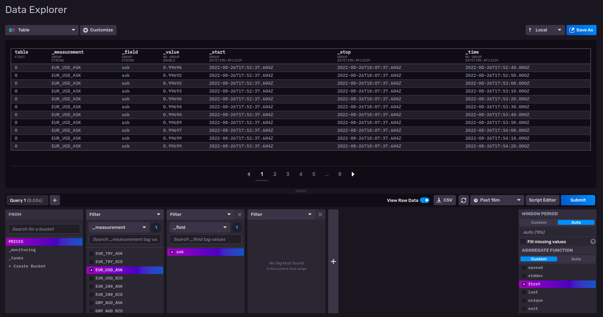

# **ForexMetrics**
  
**FR**  
FMetrics est un système de monitoring et d'alertings du marché des changes.  
Nous l'avons conçu pour les investisseurs indépendants notamment les débutants qui souhaitent se lancer dans le trading du Forex.   
**EN**  
FMetrics is a foreign exchange market monitoring and alerting system.  
We have designed it for independent investors, especially beginners who want to get started in Forex trading.
## GET STARTED

**Prerequisites:**
- You have a Oanda test account
- You have a mailjet account
- You must have docker installed

### Create a hidden file .env at project root with the next environnement variables. It is the main key to correctly launch the project:

```
#DB
MYSQL_ROOT_PASSWORD=MYSQL_ROOT_PASSWORD
MYSQL_DATABASE=MYSQL_DATABASE
DB_PORT=DB_PORT

#BACKEND
DB_USER=DB_USER
DB_PASSWORD=DB_PASSWORD
DB_ENGINE=django.db.backends.mysql
DB_HOST=db  # db service name
DB_TEST_NAME=DB_TEST_NAME
DB_PORT=DB_PORT
DB_NAME=DB_NAME
BACKEND_PORT=BACKEND_PORT
SECRET_KEY=SECRET_KEY
DEBUG=True #DEV OR False #PROD
TOKEN_EXPIRATION_DAYS=TOKEN_EXPIRATION_DAYS

#MAILER
MJ_APIKEY_PUBLIC=MJ_APIKEY_PUBLIC
MJ_APIKEY_PRIVATE=MJ_APIKEY_PRIVATE
EMAIL_HOST=EMAIL_HOST #domain_name email
MAILER_PORT=MAILER_PORT

#OANDA
OANDA_TOKEN=OANDA_TOKEN
OANDA_ACCOUNT_ID=OANDA_ACCOUNT_ID

#INFLUX
DOCKER_INFLUXDB_INIT_MODE=setup
DOCKER_INFLUXDB_INIT_USERNAME=DOCKER_INFLUXDB_INIT_USERNAME
DOCKER_INFLUXDB_INIT_PASSWORD=DOCKER_INFLUXDB_INIT_PASSWORD # Minimum length of 8 characters
DOCKER_INFLUXDB_INIT_ORG=DOCKER_INFLUXDB_INIT_ORG
DOCKER_INFLUXDB_INIT_BUCKET=DOCKER_INFLUXDB_INIT_BUCKET
DOCKER_INFLUXDB_INIT_ADMIN_TOKEN=DOCKER_INFLUXDB_INIT_ADMIN_TOKEN
INFLUX_PORT=INFLUX_PORT

#STREAMER
PRICING_STREAMER_PORT=PRICING_STREAMER_PORT

#INFLUX_CONNECTOR
INFLUX_CONNECTOR_PORT=INFLUX_CONNECTOR_PORT

#ALERT_CHECKER
ALERT_CHECKER_PORT=ALERT_CHECKER_PORT
```
---
### Logger prerequisites:
- The root of the project
- The root of backend service
- The root of mailer service
- Create and edit a fluent.conf file inside a conf folder itself inside the project root logs folder to configure the logger behavior -> https://docs.fluentd.org/configuration/config-file  
---
### Front-end prerequisites
- Create a nginx folder at the root of web service. Create and edit a nginx.conf file -> https://www.nginx.com/resources/wiki/start/topics/examples/full/  
- Compile the front-end before launching the webserver service with this command:
  ```
  npm run build
  ```  
    *It will copy the compliled folder build to the docker container througth the docker volume at runtime*
--- 
### To launch all the application services with docker follow the following steps :
**At the root of the project where docker-compose yml is located:**
```bash
docker-compose up -d
```

**Check that all docker containers are running**
```bash
docker ps
```
---

## Influx Connector Documentation
*Prerequisites*  
At least streamer service and influx connector service must be running.

### Authentication
The username, user password, organisation name, bucket name, and the initialisation mode when the docker is launched are defined by the next variables in your .env:

- DOCKER_INFLUXDB_INIT_MODE=setup
- DOCKER_INFLUXDB_INIT_USERNAME=DOCKER_INFLUXDB_INIT_USERNAME
- DOCKER_INFLUXDB_INIT_PASSWORD=DOCKER_INFLUXDB_INIT_PASSWORD   # Minimum length of 8 characters
- DOCKER_INFLUXDB_INIT_ORG=DOCKER_INFLUXDB_INIT_ORG
- DOCKER_INFLUXDB_INIT_BUCKET=DOCKER_INFLUXDB_INIT_BUCKET

Once they are defined on your machine you can navigate to the influx ui with your browser:  
  
Then login with your credentials:  
  
You can see informations about client setup in different langages and generate a token on the data button:  
  
Then you can manipulate the measurements thanks to this board:  
  
You can also play with the time window configuration thanks to this board:  
  


### Some informations about influx
- A **bucket** is a group of SQL database table.
- A **series** is a logical grouping of data defined by shared measurement, tag and field.
- A **measurement** is similar to an SQL database table.
- A **tag** is similar to indexed columns in an SQL database.
- A **field** is similar to unindexed columns in an SQL database.
- A **point** is similar to SQL row.

---
## Documentation of endpoints is located on documentation folder under different format types.
  

## The logs can be checked on local logs folder generated at runtime.
  

## FMETRICS ARCHITECTURE
**The application is built over 10 services**  
- The **backend** service (*Django Framework*) which contains all application logic.
- The **db** service (*Mysql DB*) which contains all user and alerts data.
- The **webserver** service (*React/Nginx*) which contains the compiled UI saved on an Nginx reverse-proxy server.
- The **cerbot** service (*Cerbot*) which is charged to generate and refresh ssl certificate to allow https navigation on browser.
- The **pricing_streamer** service (*Python*) which is charged to connect himself to Oanda broker throught websocket (tcp connection) and stream cleaned market data to influx and alert_checker services.
- The **influx** service (*InfluxDB*) which aims to graphically transmit market data to the webserver and save historical market data.
- The **Influx_connector** service (*Python*) is charged to prepare the injection of market data into influx service.
- The **alert_checker** service (*Python*) is a background worker which constantly checks if an alert must be deactivated.
- The **mailer** service (*Python*) which is called when a mail must be sent to a customer.
- The **logger** service (*Fluentd*) which aggregate, clean logs from the backend and the mailer and is able to stream them into a file or a AWS S3 bucket for a production purpose. 

---
## To launch unit tests:
*Launch backend container in interactive mode and run this command:*
```bash
python manage.py test
```
*You can also launch them in verbose mode*
```
python manage.py test -v 2
```
  
*The test database creation and the models migrations are automatically launched when the tests are launched.*

---
### Bots are available inside the backend to create fake data or fake alerts:
**Prerequisites:**
- Backend service running
- Mysql service running
- Database existant in mysql

**Create n realistic alert configurations by modifying the second parameter of the next function in fake_users.py:**\
*Second parameter is the number of alerts created by differents users.*

```python
alert_builder(user_creator(), 10)
```

Go inside the backend docker and run this command to generate fake data:
```
sh faker.sh
```
---
### Migrations
The models migrations are automatically launched at runtime when the development backend service/container is launched.

---
### More info for developers
**You can also attach the thread to a terminal in order to follow the log of a specific container:**
```bash
docker-compose up <CONTAINER ID>
```

**You can rebuild the images and relaunch the docker containers this way**
```bash
docker-compose up -d --build
```

**To launch a docker container in interactive mode:**
```bash
docker ps
docker exec -it <CONTAINER ID> bash
```

**To enter the mysql container launch the mysql container in interactive mode and create a database is it not exist:**
```bash
mysql -u username -p
password
use database_name;
create database database_name;
```
*If database does not exist the migrations will fail*


**To migrate the backend models to mysql docker container, launch the backend container in interactive mode (normally automatically launched at docker runtime):**
```bash
python manage.py makemigrations
python manage.py migrate
```
*makemigrations is necessary only if migration files are not existent on local machine*


### In order to launch the Back-end in localhost follow the next steps:
---
*Configure your local database.*\
*Configure the database const in src/backend/ForexMetricsBackend/settings.py with your local database settings.*

**Create a virtualenv at project root**
```python
pip install virtualenv
virtualenv venv
```

**Activate your environment**
###### On Linux:
```bash
source venv/bin/activate
```
###### On Windows:
```bash
venv\Scripts\activate
```
**Install the dependencies once the environment is activated**\
*Inside Backend folder*
```python
pip install -r requirements.txt
```
**launch migration files generation from inside the backend**
```python
python manage.py makemigrations
```
**launchmigrate django data models to database**
```python
python manage.py migrate
```
**launch server**
```python
python manage.py runserver
```
